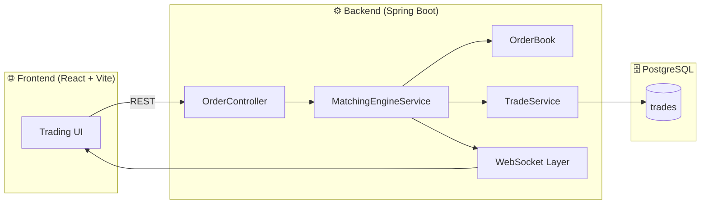
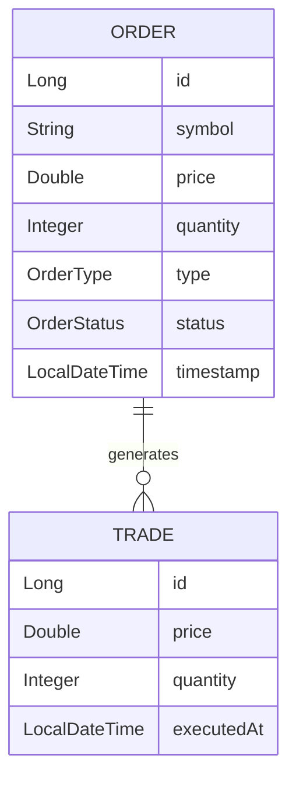
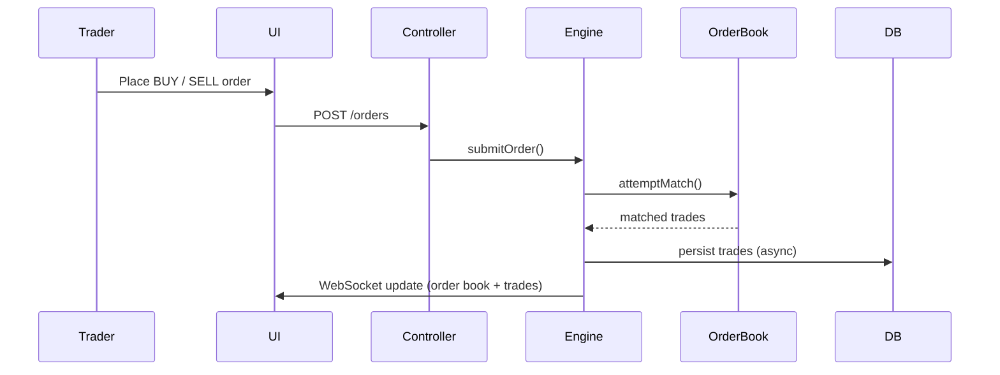

# 📈 Real-Time Stock Matching Engine (Full Stack)

### 🚀 Project Overview
   This is a full-stack, real-time stock trading engine that simulates the core backend mechanics of a modern stock exchange.It implements a price–time priority limit order book, supports BUY/SELL orders, partial fills, trade execution,     and delivers live market updates to clients using WebSockets.This project focuses on backend system design, concurrency, and real-time data flow, rather than just CRUD operations.
---
### ⭐ Key Features
  ### 📊 Trading Engine (Backend Core)
   - Price–Time Priority Limit Order Book
   - BUY / SELL order placement
   - Partial and full order matching
   - Trade generation & persistence
   - In-memory order book with async trade storage
   - Thread-safe matching logic
   - Configured async executor for scalability
  ### 🔄 Real-Time Updates
   - Live order book updates via WebSockets
   - Real-time trade history streaming
   - Instant UI updates without polling
  ### 🖥️ Frontend 
   - Place BUY / SELL orders
   - Live depth chart visualization
   - Order book (bids & asks)
   - Trade history feed
   - My Orders tracking
   - Market statistics bar
---
### 🏗️ System Architecture

---
## 📊 Data Model (ER Diagram)

---
### 🔁 Order Matching Flow (Price–Time Priority)

### 📸 Screenshots

---
### 🧠 Backend Project Structure
    src/main/java/com.stock_trading_engine
     ├── config
     │   ├── AsyncConfig
     │   └── WebSocketConfig
     ├── controller
     │   └── OrderController
     ├── model
     │   ├── Order
     │   ├── Trade
     │   ├── OrderType
     │   └── OrderStatus
     ├── orderbook
     │   ├── OrderBook
     │   └── OrderBookManager
     ├── service
     │   ├── MatchingEngineService
     │   └── TradeService
     └── StockTradingEngineApplication
---

