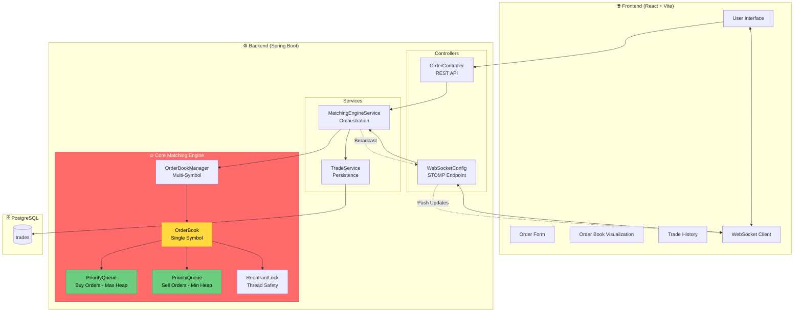
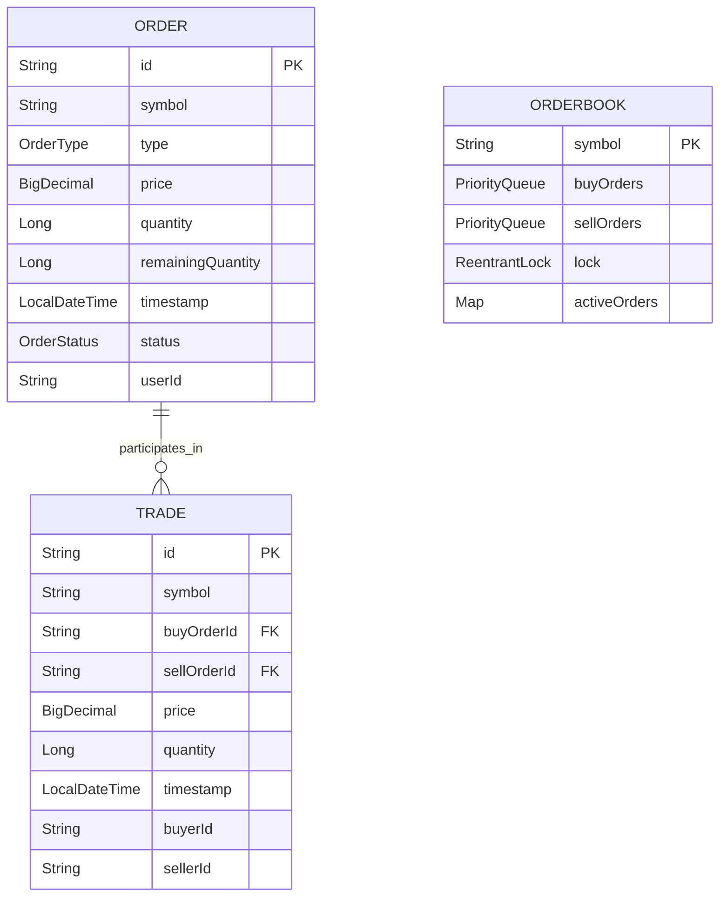
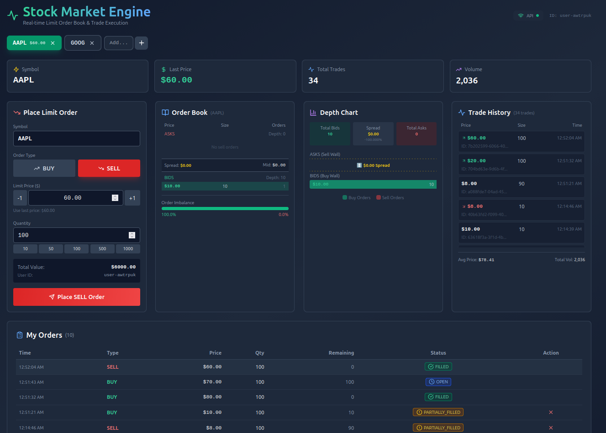

# 📈 Wall Street - Real-Time Stock Matching Engine 

[](https://www.oracle.com/java/)
[](https://spring.io/projects/spring-boot)
[](https://www.postgresql.org/)
[](https://react.dev/)
[](https://vitejs.dev/)
[](https://tailwindcss.com/)

### 🚀 Project Overview

   This is a full-stack, real-time stock trading engine that simulates the core backend mechanics of a modern stock exchange. It implements a price–time priority limit order book, supports BUY/SELL orders, partial fills, trade execution,     and delivers live market updates to clients using WebSockets.This project focuses on backend system design, concurrency, and real-time data flow, rather than just CRUD operations.
   
-----------------------------------------------------------------------------------------
### ⭐ Key Features
  ### 📊 Trading Engine (Backend Core)
   - Price–Time Priority Limit Order Book
   - BUY / SELL order placement
   - Partial and full order matching
   - Trade generation & persistence
   - In-memory order book with async trade storage
   - Thread-safe matching logic
   - Configured async executor for scalability
  ### 🔄 Real-Time Updates
   - Live order book updates via WebSockets
   - Real-time trade history streaming
   - Instant UI updates without polling
  ### 🖥️ Frontend 
   - Place BUY / SELL orders
   - Live depth chart visualization
   - Order book (bids & asks)
   - Trade history feed
   - My Orders tracking
   - Market statistics bar
---
### 🏗️ System Architecture

---
## 📊 Data Model (ER Diagram)

-------------------------------------------------------
### 🔁 Order Matching Flow (Price–Time Priority)
```mermaid
sequenceDiagram
    participant Client
    participant Controller
    participant MatchingEngine
    participant OrderBook
    participant TradeService
    participant WebSocket
    participant Database

    Client->>Controller: POST /api/orders<br/>{symbol, type, price, quantity}
    Controller->>MatchingEngine: processOrder(order)
    MatchingEngine->>OrderBook: addOrder(order)
    
    activate OrderBook
    Note over OrderBook: lock.lock()
    OrderBook->>OrderBook: buyOrders.offer(order)<br/>O(log n)
    OrderBook->>OrderBook: match()
    
    loop While bestBuy >= bestSell
        OrderBook->>OrderBook: executeTrade()
        Note over OrderBook: Update quantities<br/>Create Trade object
    end
    
    Note over OrderBook: lock.unlock()
    OrderBook-->>MatchingEngine: List&lt;Trade&gt;
    deactivate OrderBook
    
    MatchingEngine->>TradeService: saveTrades(trades)<br/>@Async
    activate TradeService
    TradeService->>Database: INSERT trades
    deactivate TradeService
    
    MatchingEngine->>WebSocket: broadcast trades
    WebSocket-->>Client: Trade notifications
    
    MatchingEngine->>WebSocket: broadcast order book
    WebSocket-->>Client: Order book update
    
    MatchingEngine-->>Controller: OrderResponse
    Controller-->>Client: {orderId, status, trades}
```
------------------------------------------------------------
### 📸 Screenshots
#### Home Page

---------------------------------------------
### 🧠 Backend Project Structure
    src/main/java/com.stock_trading_engine
     ├── config
     │   ├── AsyncConfig
     │   └── WebSocketConfig
     ├── controller
     │   └── OrderController
     ├── model
     │   ├── Order
     │   ├── Trade
     │   ├── OrderType
     │   └── OrderStatus
     ├── orderbook
     │   ├── OrderBook
     │   └── OrderBookManager
     ├── service
     │   ├── MatchingEngineService
     │   └── TradeService
     └── StockTradingEngineApplication
-----------------------------------------
### 🧩 Frontend Structure
      src
       ├── components
       │   ├── DepthChart.jsx
       │   ├── OrderBook.jsx
       │   ├── OrderForm.jsx
       │   ├── TradeHistory.jsx
       │   └── StatsBar.jsx
       ├── hooks
       │   ├── useOrderBook.js
       │   └── useWebSocket.js
       ├── services
       │   ├── api.js
       │   └── websocket.js
       └── App.jsx
--------------------------------------------
### 🔌 API Endpoints
   ### Orders
   - POST /api/orders – Place a BUY / SELL limit order
   - DELETE /api/orders/{symbol}/{orderId} – Cancel an existing order
   - GET /api/orderbook/{symbol} – Get current order book snapshot for a symbol
   ### Trades
   - GET /api/trades/{symbol}?limit=50 – Get recent executed trades for a symbol
   ### WebSocket
   - /ws – WebSocket connection endpoint
   - /topic/orderbook/{symbol} – Live order book updates
   - /topic/trades/{symbol} – Live trade execution updates
------------------------------------------------------------------------------------
### ⚙️ Tech Stack
   ### Backend
   - Java 17
   - Spring Boot 3
   - Spring Web
   - Spring WebSocket
   - Spring Data JPA
   - PostgreSQL
   - Async Task Executor
   - Maven
   ### Frontend
   - React 18
   - Vite
   - Tailwind CSS
   - WebSockets
   - Axios
-----------------------------------------------------------------------------------------
