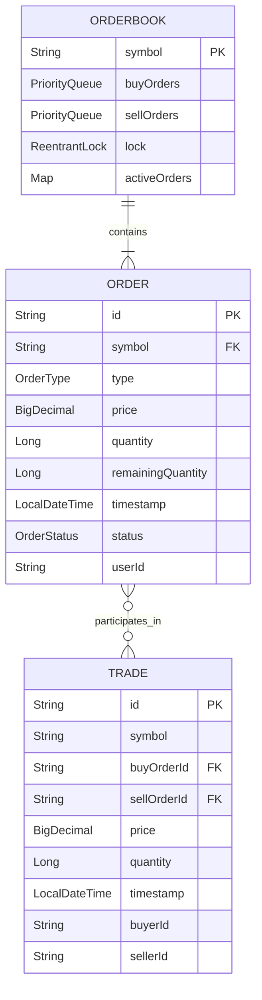
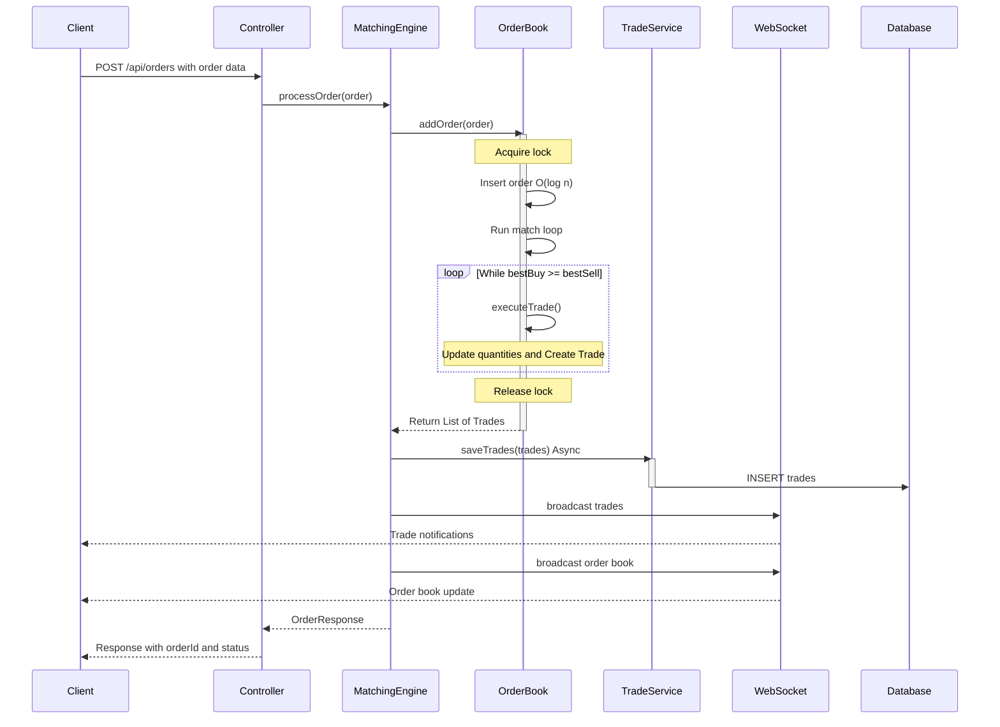

# 📈 Wall Street - Real-Time Stock Matching Engine 

### 🚀 Project Overview

   This is a full-stack, real-time stock trading engine that simulates the core backend mechanics of a modern stock exchange. It implements a price–time priority limit order book, supports BUY/SELL orders, partial fills, trade execution,     and delivers live market updates to clients using WebSockets.This project focuses on backend system design, concurrency, and real-time data flow, rather than just CRUD operations.
   
-----------------------------------------------------------------------------------------
### ⭐ Key Features
  ### 📊 Trading Engine (Backend Core)
   - Price–Time Priority Limit Order Book
   - BUY / SELL order placement
   - Partial and full order matching
   - Trade generation & persistence
   - In-memory order book with async trade storage
   - Thread-safe matching logic
   - Configured async executor for scalability
  ### 🔄 Real-Time Updates
   - Live order book updates via WebSockets
   - Real-time trade history streaming
   - Instant UI updates without polling
  ### 🖥️ Frontend 
   - Place BUY / SELL orders
   - Live depth chart visualization
   - Order book (bids & asks)
   - Trade history feed
   - My Orders tracking
   - Market statistics bar
---
### 🏗️ System Architecture

``` mermaid
flowchart TB
    %% ======================= CLIENT ======================
    subgraph Client["🌐 Frontend (React + Vite)"]
        UI["User Interface"]
        OrderForm["Order Form"]
        OrderBookViz["Order Book<br/>Visualization"]
        TradeHistory["Trade History"]
        WSClient["WebSocket Client<br/>(STOMP)"]
    end

    %% ======================= BACKEND ======================
    subgraph Server["⚙️ Backend (Spring Boot 3)"]
        OrderController["OrderController<br/>(REST API)"]
        WSConfig["WebSocketConfig<br/>(STOMP Broker)"]

        MatchingEngine["MatchingEngineService<br/>(Orchestration)"]
        TradeService["TradeService<br/>(Persistence)"]

        subgraph Core["🔥 Core Matching Engine"]
            OBManager["OrderBookManager<br/>(Multi-Symbol)"]
            OrderBook["OrderBook<br/>(Single Symbol)"]

            subgraph DataStructures["Data Structures"]
                PQBuy["PriorityQueue<br/>Buy Orders<br/>(Max-Heap)"]
                PQSell["PriorityQueue<br/>Sell Orders<br/>(Min-Heap)"]
            end

            Lock["ReentrantLock<br/>(Thread Safety)"]
            ConcurrentMap["ConcurrentHashMap<br/>(Symbol Isolation)"]
        end
    end

    %% ======================= DATABASE ======================
    subgraph DB["🗄️ PostgreSQL"]
        TradeTable[(trades)]
    end

    %% ======================= CONNECTIONS ======================
    UI --> OrderForm
    UI --> OrderBookViz
    UI --> TradeHistory
    OrderForm --> OrderController
    UI <--> WSClient

    WSClient <--> WSConfig
    OrderController --> MatchingEngine
    WSConfig --> MatchingEngine

    MatchingEngine --> OBManager
    MatchingEngine -->|Async Execution| TradeService

    OBManager --> ConcurrentMap
    ConcurrentMap --> OrderBook
    OrderBook --> PQBuy
    OrderBook --> PQSell
    OrderBook --> Lock

    TradeService --> TradeTable
    MatchingEngine -.->|Broadcast| WSConfig
    WSConfig -.->|Push Updates| WSClient

    %% ======================= STYLES ======================
    style Core fill:#ff6b6b,stroke:#c92a2a,color:#fff
    style DataStructures fill:#ffd93d,stroke:#f5a623,color:#000
    style OrderBook fill:#6bcf7f,stroke:#38a169,color:#000

```

---
## 📊 Data Model (ER Diagram)

-------------------------------------------------------
### 🔁 Order Matching Flow (Price–Time Priority)

------------------------------------------------------------
### 📸 Screenshots
#### Home Page

---------------------------------------------
### 🔌 API Endpoints
   ### Orders
   - POST /api/orders – Place a BUY / SELL limit order
   - DELETE /api/orders/{symbol}/{orderId} – Cancel an existing order
   - GET /api/orderbook/{symbol} – Get current order book snapshot for a symbol
   ### Trades
   - GET /api/trades/{symbol}?limit=50 – Get recent executed trades for a symbol
   ### WebSocket
   - /ws – WebSocket connection endpoint
   - /topic/orderbook/{symbol} – Live order book updates
   - /topic/trades/{symbol} – Live trade execution updates
------------------------------------------------------------------------------------
### 🧠 Backend Project Structure
    src/main/java/com.stock_trading_engine
     ├── config
     │   ├── AsyncConfig
     │   └── WebSocketConfig
     ├── controller
     │   └── OrderController
     ├── model
     │   ├── Order
     │   ├── Trade
     │   ├── OrderType
     │   └── OrderStatus
     ├── orderbook
     │   ├── OrderBook
     │   └── OrderBookManager
     ├── service
     │   ├── MatchingEngineService
     │   └── TradeService
     └── StockTradingEngineApplication
-----------------------------------------
### 🧩 Frontend Structure
      src
       ├── components
       │   ├── DepthChart.jsx
       │   ├── OrderBook.jsx
       │   ├── OrderForm.jsx
       │   ├── TradeHistory.jsx
       │   └── StatsBar.jsx
       ├── hooks
       │   ├── useOrderBook.js
       │   └── useWebSocket.js
       ├── services
       │   ├── api.js
       │   └── websocket.js
       └── App.jsx
--------------------------------------------
### ⚙️ Tech Stack
   ### Backend
   - Java 17
   - Spring Boot 3
   - Spring Web
   - Spring WebSocket
   - Spring Data JPA
   - PostgreSQL
   - Async Task Executor
   - Maven
   ### Frontend
   - React 18
   - Vite
   - Tailwind CSS
   - WebSockets
   - Axios
-----------------------------------------------------------------------------------------
